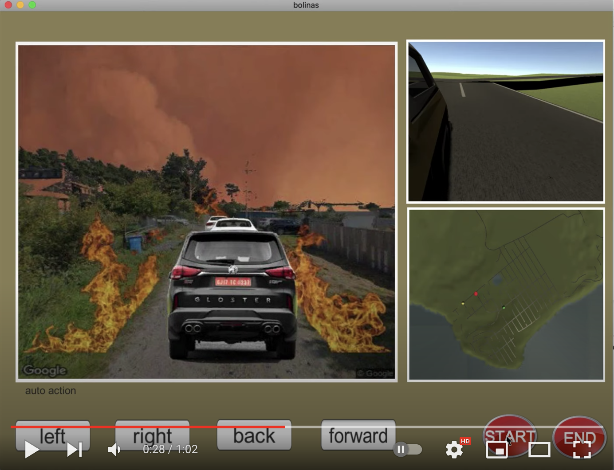
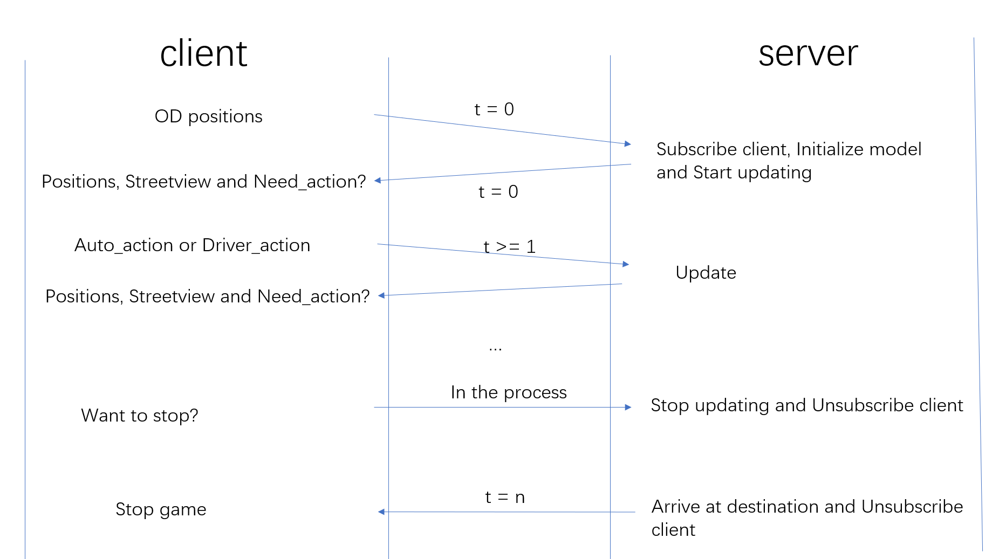
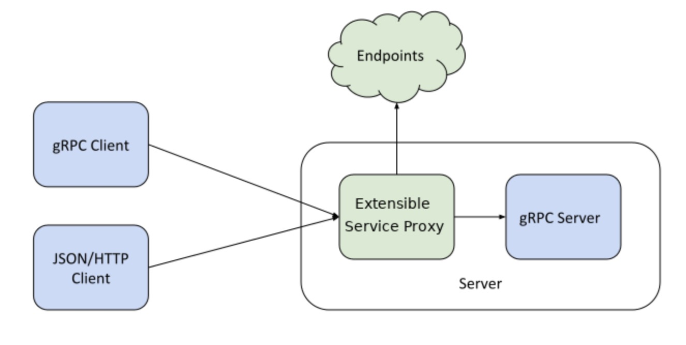

# Traffic Model for Fire Game

The traffic model plays as a backend server calculation in the bolinas fire game, the main algorithm of which is adapted
from [`Spatial Queue Simulator`](https://github.com/cb-cities/spatial_queue) developed by Bingyu Zhao. If you want to understand
this spatial-queue-based model, you can go to algorithm [`repository`](https://github.com/cb-cities/spatial_queue). If you just want
it to run without knowing the detail, you should build the dependency Shortest path [`sp`](https://github.com/cb-cities/sp).

In README.md, We mainly explain three parts, including:

1. how to realize the communication between unity game and traffic model;
2. how to deploy traffic model into google cloud.
3. Some details in game design

## 1. Realize the Communication

We use grpc to make unity communicate with traffic algorithm written by python. The advantage is that we can just define functions and its 
parameters in one .proto file, then after generating corresponding client and server interface, the same functions can 
be used by different languages. If you are not familiar with grpc, go to this [`website`](https://www.grpc.io/docs/what-is-grpc/).

For python server, we have include grpcio and grpcio-tools in requirements.txt. After installing all these packages, generate python
server interface by command:

`python -m grpc_tools.protoc -Icommunicate --python_out=communicate/server --grpc_python_out=communicate/server communicate/Drive.proto`

The c# unity plugin can be downloaded at this [`link`](https://intl.cloud.tencent.com/document/product/1055/39057#test) first(because it's hard
to find download link, I just provide it), then generate c# client interface by command:

`cd communicate`

`protoc -I . --csharp_out=client --grpc_out=client --plugin=protoc-gen-grpc=grpc_csharp_plugin Drive.proto`

Grpc is easy to use. But I did not find any tutorials or information in python-grpc to distinguish between 
different clients, (Go-grpc has). However, in our scenario, we must distinguish between different clients, because 
each client must communicate with traffic model every timestamp to get the updated position. If server cannot distinguish 
them, they cannot send correct position info to correct client. I read some answers of relevant StackOverflow questions, and 
write one solution by myself, the details are shown in one
[`post`](https://stackoverflow.com/questions/70044862/how-to-make-each-client-get-their-state-if-there-is-class-instance-in-grpc-pytho) 
in StackOverflow. If you have any other better solutions, feel free to tell me.

The communication process between client and server can be expressed by the image as followed:

We also write the dockerfile for this repository, you can build image by using Dockerfile in this repository or pull from docker hub
`docker pull yanglan/game-server:1.0`.

### Run the simulation

`docker run -it -p 50051:50051 game_server`

## 2. Deploy traffic model into google cloud.

Google Cloud Endpoints works with Extensible Service Proxy(ESP) or the Extensible Service Proxy V2(ESP V2) to provide API 
management.

With Endpoints for gRPC, we can use the API management capabilities of Endpoints to add API console, monitoring, 
authentication or more to gRPC services. We can even change RESTful JSON over HTTP to gRPC requests, which gives
us more flexibility to integrate with other systems. But in our scenario, both clients and servers use gRPC, there is not need to change the data format.

This image is downloaded in Google Cloud for better understanding the role of Endpoints.

After configuring and deploying the Endpoints, we can deploy the API and ESPv2 on the Compute Engine VM. 
For more detailed info, follow the tutorial in [`google cloud`](https://cloud.google.com/endpoints/docs/grpc/get-started-compute-engine-docker-espv2) 

## 3. Design of game

I showed the video of playing our fire evacuation game, and the built game will be published later to let users play. For the game, first
we need to create simply 3d model to present bolinas' s different types of terrain, traffic network structure and vehicles' movement. We
don' t spend too much time building the detailed bolinas 3d model, which means more work in art area and may be more suitable 
for commercial team. 

However, we also want to provide realistic feeling to players who are also local residents mostly. Therefore, we downloaded bolinas
streetview from google and want to apply some image synthesis work to add fire effects and real-time vehicle information to raw 
image. This part is also the direction of later improvement. We want to realize realistic and automatic image synthesis finally.

Finally, Thanks for advice from Professor Kenichi Soga, Professor Louise Comfort, Bingyu, Paola, and Kecheng.
 